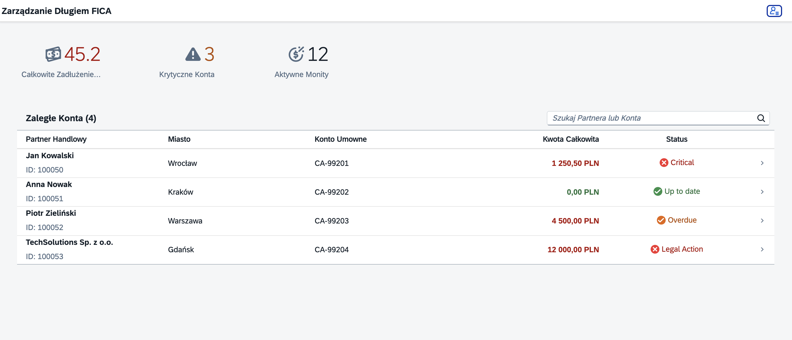

# 📊 SAP FICA Debt Management Dashboard

> A Fiori-based dashboard designed for **SAP FICA (Contract Accounts Receivable and Payable)** analysts to monitor overdue debt, dunning runs, and critical business partners.


## 💡 Project Overview

This application bridges the gap between **Complex SAP FICA Backend Processes** and **Modern Frontend Usability**. It provides a clear, responsive interface for Debt Collection Agents to identify critical accounts and take action without navigating through legacy GUI transactions (like FPL9 or FP03).

**Key Value Proposition:**
* **Role-Based Design:** Tailored specifically for the "Collections Specialist" persona.
* **Instant Insights:** Top-level KPIs for quick decision-making.
* **Localized:** Fully translated for international teams (**English, Spanish, and Polish**).

## 🚀 Key Features

* **📈 KPI Header:** Implemented using **XML Fragments** to maintain clean code architecture. Displays real-time metrics (Total Debt, Critical Accounts, Active Dunning Runs).
* **🌍 Internationalization (i18n):**
    * Full support for **English (`en`)**, **Spanish (`es`)**, and **Polish (`pl`)**.
    * **Strategic Localization:** Specifically adapted for the **Polish SAP market** (Wrocław/Warsaw hubs), demonstrating readiness for regional business requirements.
    * Automatic fallback logic handled via `manifest.json`.
* **💾 Mock Server Data:**
    * Simulates OData V2 backend responses using a local JSON model (`fica>`).
    * Realistic FICA data structures (Business Partner, Contract Account, Currency).
* **🎨 Fiori Design Guidelines:**
    * Usage of Semantic Colors (`Critical`, `Error`, `Success`) for debt status.
    * Responsive `sap.m.Table` with pop-in columns for mobile devices.
    * Formatters for currency and conditional logic.

## 🛠️ Technical Stack

* **Framework:** SAPUI5 / OpenUI5 (XML Views & JS Controllers)
* **Tooling:** SAP Fiori Tools, UI5 CLI, Node.js
* **Architecture:** MVC (Model-View-Controller)
* **Languages:** JavaScript (ES6), XML, JSON

## 📸 Screenshots


## 🔧 Installation & Setup

Prerequisites: Node.js (v16+)

```bash
# 1. Clone the repository
git clone [https://github.com/stockia/sap-fiori-fica-dashboard.git](https://github.com/stockia/sap-fiori-fica-dashboard.git)

# 2. Navigate to project folder
cd sap-fiori-fica-dashboard

# 3. Install dependencies
npm install

# 4. Run the development server
npm start
```

> **💡 Pro Tip:** To test the **Polish localization**, simply append the language parameter to your URL:
> `http://localhost:8080/index.html?sap-ui-language=pl`

## 👨‍💻 About the Author

**Alex Stocki**
* **Frontend Developer** +3 Years. Leveraging deep expertise in Ember.js (MVC frameworks) to build scalable **SAP Fiori/UI5** applications.
* **Background:** 3 Years as **SAP FICA Functional Analyst**.
* **Focus:** Bridging the gap between complex backend logic and modern, intuitive user interfaces.

---
*Disclaimer: This is a personal portfolio project and is not affiliated with SAP SE.*